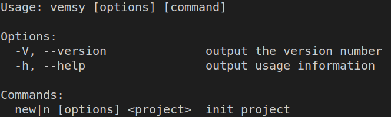

# vemsy-cli

This package provide a command line for [vemsy](https://www.npmjs.com/package/vemsy)
This package provide the template folder with the documentation in the [template folder](./template)

## Install

It is best to install it globaly

`npm install -g vemsy-cli`

## Usage

Launching the init command (`vemsy new <my_project_name>`) will copy the files in the [template folder](./template) and then install it.
